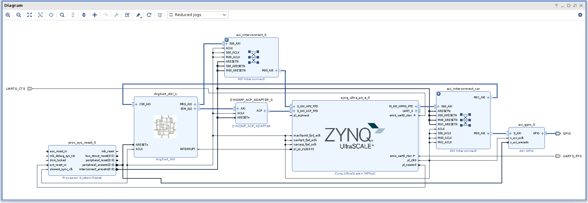

ArgSorter for Ultra96
====================================================================================

Overvier
------------------------------------------------------------------------------------

### Requirement

* Board: any of the following
  - Ultra96
  - Ultra96-V2
* OS: any of the following
  - https://github.com/ikwzm/ZynqMP-FPGA-Linux
  - https://github.com/ikwzm/ZynqMP-FPGA-Ubuntu18.04-Ultra96

### Licensing

Distributed under the BSD 2-Clause License.

Design
------------------------------------------------------------------------------------

### Design Block



Fig.1 ArgSort-Ultra96 Design Block


### Utilization

Table.2 Utilization

<table border="2">
  <tr>
    <td align="center" colspan="4">Design</td>
    <td align="center" colspan="4">Resources</td>
    <td align="center">Freq</td>
  </tr>
  <tr>
    <td align="center">Name</td>
    <td align="center">MRG<br />WAYS</td>
    <td align="center">MRG<br />WORDS</td>
    <td align="center">STM<br />FB</td>
    <td align="center">CLB<br />LUTs</td>
    <td align="center">CLB<br />Register</td>
    <td align="center">BLOCK<br />RAM</td>
    <td align="center">DSPs</td>
    <td align="center">Freq<br />[MHz]</td>
  </tr>
  <tr>
    <td>argsort_16_1_0</td>
    <td align="center">16</td>
    <td align="center">1</td>
    <td align="center">0</td>
    <td align="center">42142</td>
    <td align="center">27011</td>
    <td align="center">38</td>
    <td align="center">0</td>
    <td align="center">250</td>
  </tr>
  <tr>
    <td>argsort_16_1_1</td>
    <td align="center">16</td>
    <td align="center">1</td>
    <td align="center">1</td>
    <td align="center">41865</td>
    <td align="center">27249</td>
    <td align="center">38</td>
    <td align="center">0</td>
    <td align="center">250</td>
  </tr>
  <tr>
    <td>argsort_16_1_2</td>
    <td align="center">16</td>
    <td align="center">1</td>
    <td align="center">2</td>
    <td align="center">41799</td>
    <td align="center">26261</td>
    <td align="center">54</td>
    <td align="center">0</td>
    <td align="center">250</td>
  </tr>
  <tr>
    <td>argsort_16_2_0</td>
    <td align="center">16</td>
    <td align="center">2</td>
    <td align="center">0</td>
    <td align="center">59246</td>
    <td align="center">55456</td>
    <td align="center">38</td>
    <td align="center">0</td>
    <td align="center">250</td>
  </tr>
  <tr>
    <td>argsort_16_2_1</td>
    <td align="center">16</td>
    <td align="center">2</td>
    <td align="center">1</td>
    <td align="center">60828</td>
    <td align="center">57063</td>
    <td align="center">38</td>
    <td align="center">0</td>
    <td align="center">250</td>
  </tr>
  <tr>
    <td>argsort_16_2_2</td>
    <td align="center">16</td>
    <td align="center">2</td>
    <td align="center">2</td>
    <td align="center">58819</td>
    <td align="center">55210</td>
    <td align="center">70</td>
    <td align="center">0</td>
    <td align="center">250</td>
  </tr>
  <tr>
    <td>argsort_32_1_0</td>
    <td align="center">32</td>
    <td align="center">1</td>
    <td align="center">0</td>
    <td align="center">64126</td>
    <td align="center">45025</td>
    <td align="center">70</td>
    <td align="center">15</td>
    <td align="center">250</td>
  </tr>
  <tr>
    <td>argsort_32_1_1</td>
    <td align="center">32</td>
    <td align="center">1</td>
    <td align="center">1</td>
    <td align="center">66621</td>
    <td align="center">46356</td>
    <td align="center">70</td>
    <td align="center">15</td>
    <td align="center">250</td>
  </tr>
  <tr>
    <td>argsort_32_1_2</td>
    <td align="center">32</td>
    <td align="center">1</td>
    <td align="center">2</td>
    <td align="center">64988</td>
    <td align="center">44866</td>
    <td align="center">198</td>
    <td align="center">15</td>
    <td align="center">250</td>
  </tr>
  <tr>
    <td>argsort_32_2_0</td>
    <td align="center">32</td>
    <td align="center">2</td>
    <td align="center">0</td>
    <td align="center" colspan="4">resource over</td>
    <td align="center"></td>
  </tr>
  <tr>
    <td colspan="4">zcu3egsbva48-1 resouce available</td>
    <td align="center">70560</td>
    <td align="center">141120</td>
    <td align="center">216</td>
    <td align="center">360</td>
    <td align="center"></td>
  </tr>
</table>

<br />

")

Fig.2 Utlization(LUTs %)

<br />

### Performance


Table.3 Performance

<table border="2">
  <tr>
    <td align="center" colspan="4">Design</td>
    <td align="center" colspan="3">Sort time [msec]</td>
    <td align="center" rowspan="2">Throughput <br />Average<br />[Mwords/sec]</td>
  </tr>
  <tr>
    <td align="center">Name</td>
    <td align="center">MRG<br />WAYS</td>
    <td align="center">MRG<br />WORDS</td>
    <td align="center">STM<br />FB</td>
    <td align="center">10K<br />[words]</td>
    <td align="center">100K<br />[words]</td>
    <td align="center">1M<br />[words]</td>
  <tr>
    <td>argsort_16_1_0</td>
    <td align="center">16</td>
    <td align="center">1</td>
    <td align="center">0</td>
    <td align="right">0.569</td>
    <td align="right">4.766</td>
    <td align="right">54.456</td>
    <td align="right">18.75</td>
  </tr>
  <tr>
    <td>argsort_16_1_1</td>
    <td align="center">16</td>
    <td align="center">1</td>
    <td align="center">1</td>
    <td align="right">0.400</td>
    <td align="right">3.000</td>
    <td align="right">34.355</td>
    <td align="right">29.51</td>
  </tr>
  <tr>
    <td>argsort_16_1_2</td>
    <td align="center">16</td>
    <td align="center">1</td>
    <td align="center">2</td>
    <td align="right">0.384</td>
    <td align="right">2.674</td>
    <td align="right">27.644</td>
    <td align="right">36.04</td>
  </tr>
  <tr>
    <td>argsort_16_2_0</td>
    <td align="center">16</td>
    <td align="center">2</td>
    <td align="center">0</td>
    <td align="right">0.436</td>
    <td align="right">3.219</td>
    <td align="right">42.970</td>
    <td align="right">24.13</td>
  </tr>
  <tr>
    <td>argsort_16_2_1</td>
    <td align="center">16</td>
    <td align="center">2</td>
    <td align="center">1</td>
    <td align="right">0.325</td>
    <td align="right">2.047</td>
    <td align="right">31.311</td>
    <td align="right">33.89</td>
  </tr>
  <tr>
    <td>argsort_16_2_2</td>
    <td align="center">16</td>
    <td align="center">2</td>
    <td align="center">2</td>
    <td align="right">0.328</td>
    <td align="right">1.802</td>
    <td align="right">26.314</td>
    <td align="right">40.01</td>
  </tr>
  <tr>
    <td>argsort_32_1_0</td>
    <td align="center">32</td>
    <td align="center">1</td>
    <td align="center">0</td>
    <td align="right">0.422</td>
    <td align="right">3.384</td>
    <td align="right">39.381</td>
    <td align="right">25.69</td>
  </tr>
  <tr>
    <td>argsort_32_1_1</td>
    <td align="center">32</td>
    <td align="center">1</td>
    <td align="center">1</td>
    <td align="right">0.341</td>
    <td align="right">2.494</td>
    <td align="right">27.748</td>
    <td align="right">36.31</td>
  </tr>
  <tr>
    <td>argsort_32_1_2</td>
    <td align="center">32</td>
    <td align="center">1</td>
    <td align="center">2</td>
    <td align="right">0.595</td>
    <td align="right">2.711</td>
    <td align="right">27.433</td>
    <td align="right">36.79</td>
  </tr>
  <tr>
    <td colspan="4">ZynqMP(arm64) numpy.argsort()</td>
    <td align="right">1.790</td>
    <td align="right">32.036</td>
    <td align="right">1320.921</td>
    <td align="right">1.49</td>
  </tr>
</table>


<br />


![Fig.3 Throughput Average [Mwords/sec]](./doc/ja/argsort-ultra96-performance.jpg "Fig.3 Throughput Average [Mwords/sec]")

Fig.3 Throughput Average [Mwords/sec]

<br />


Quick Start
------------------------------------------------------------------------------------

### Install

#### Install ZynqMP-FPGA-Linux or ZynqMP-FPGA-Ubuntu18.04-Ultra96

See https://github.com/ikwzm/ZynqMP-FPGA-Linux or https://github.com/ikwzm/ZynqMP-FPGA-Ubuntu18.04-Ultra96

#### Boot Ultra96 or Ultra96-V2

#### Login fpga user

#### Download ArgSort-Ultra96 to Ultra96

```console
fpga@debian-fpga:~/$ git clone --branch 1.2.1 git://github.com/ikwzm/ArgSort-Ultra96.git
fpga@debian-fpga:~/$ cd ArgSort-Ultra96
```

#### Set TARGET to Rakefile.env

```console
fpga@debian-fpga:~/ArgSort-Ultra96 cat Rakefile.env
---
TARGET: argsort_16_2_2
```
Specify the base name of the Bitstream file you want to execute in place of TARGET:.

#### Set BASE_DTS to Rakefile.env

##### For ZynqMP-FPGA-Linux-Kernel-6.1

```console
fpga@debian-fpga:~/ArgSort-Ultra96 cat Rakefile.env
---
TARGET: argsort_16_2_2
BASE_DTS: argsort_axi_6.1.dts
```

##### For ZynqMP-FPGA-Linux-Kernel-6.6

```console
fpga@debian-fpga:~/ArgSort-Ultra96 cat Rakefile.env
---
TARGET: argsort_16_2_2
BASE_DTS: argsort_axi_6.6.dts
```

The following changes have been made since ZynqMP-FPGA-Linux-Kernel-6.6(or later).

  * The node name of "fpga-full" has been changed to "fpga-region".
  * The fclk kernel driver is no longer built in by default.

so a new device tree is required.

##### For ZynqMP-FPGA-Linux-Kernel-6.12

```console
fpga@debian-fpga:~/ArgSort-Ultra96 cat Rakefile.env
---
TARGET: argsort_16_2_2
BASE_DTS: argsort_axi_6.12.dts
```

#### Install FPGA Bitstream file and Device Tree

```console
fpga@debian-fpga:~/ArgSort-Ultra96$ sudo TARGET=argsort_16_2_2 BASE_DTS=argsort_axi_6.12.dts rake install
gzip -d -f -c argsort_16_2_2.bin.gz > /lib/firmware/argsort_16_2_2.bin
./dtbocfg.rb --install argsort --dts argsort_16_2_2_6.12.dts
<stdin>:36.16-41.20: Warning (unit_address_vs_reg): /fragment@2/__overlay__/uio_argsort: node has a reg or ranges property, but no unit name
<stdin>:27.13-61.5: Warning (avoid_unnecessary_addr_size): /fragment@2: unnecessary #address-cells/#size-cells without "ranges", "dma-ranges" or child "reg" property
[  662.366716] fpga_manager fpga0: writing argsort_16_2_2.bin to Xilinx ZynqMP FPGA Manager
[  662.521878] OF: overlay: WARNING: memory leak will occur if overlay removed, property: /fpga-region/firmware-name
[  662.535253] fclkcfg amba_pl@0:fclk0: driver version : 1.9.1
[  662.540860] fclkcfg amba_pl@0:fclk0: device name    : amba_pl@0:fclk0
[  662.547375] fclkcfg amba_pl@0:fclk0: clock  name    : pl0_ref
[  662.553158] fclkcfg amba_pl@0:fclk0: clock  rate    : 249999998
[  662.559122] fclkcfg amba_pl@0:fclk0: clock  enabled : 1
[  662.564351] fclkcfg amba_pl@0:fclk0: remove rate    : 1000000
[  662.570096] fclkcfg amba_pl@0:fclk0: remove enable  : 0
[  662.575322] fclkcfg amba_pl@0:fclk0: driver installed.
[  662.599709] u-dma-buf udmabuf-argsort-in: driver version = 5.4.2
[  662.605747] u-dma-buf udmabuf-argsort-in: major number   = 234
[  662.611584] u-dma-buf udmabuf-argsort-in: minor number   = 0
[  662.617247] u-dma-buf udmabuf-argsort-in: phys address   = 0x000000006db00000
[  662.624389] u-dma-buf udmabuf-argsort-in: buffer size    = 33554432
[  662.630659] u-dma-buf amba_pl@0:udmabuf_argsort_in: driver installed.
[  662.652935] u-dma-buf udmabuf-argsort-out: driver version = 5.4.2
[  662.659060] u-dma-buf udmabuf-argsort-out: major number   = 234
[  662.664989] u-dma-buf udmabuf-argsort-out: minor number   = 1
[  662.670740] u-dma-buf udmabuf-argsort-out: phys address   = 0x000000006fb00000
[  662.677962] u-dma-buf udmabuf-argsort-out: buffer size    = 33554432
[  662.684318] u-dma-buf amba_pl@0:udmabuf_argsort_out: driver installed.
[  662.747650] u-dma-buf udmabuf-argsort-tmp: driver version = 5.4.2
[  662.753778] u-dma-buf udmabuf-argsort-tmp: major number   = 234
[  662.759709] u-dma-buf udmabuf-argsort-tmp: minor number   = 2
[  662.765459] u-dma-buf udmabuf-argsort-tmp: phys address   = 0x0000000071b00000
[  662.772696] u-dma-buf udmabuf-argsort-tmp: buffer size    = 134217728
[  662.779138] u-dma-buf amba_pl@0:udmabuf_argsort_tmp: driver installed.
```

### Run 

#### Generate sample_0001000000.npy

```console
fpga@debian-fpga:~/ArgSort-Ultra96$ rake sample_0001000000.npy
python3 generate_sample.py --size 1000000 --sample sample_0001000000.npy
generate_sample: sample_file : sample_0001000000.npy
generate_sample: size        : 1000000
generate_sample: time        : 44.262 [msec]
```

#### Generate expect_0001000000.npy

```console
fpga@debian-fpga:~/ArgSort-Ultra96$ rake expect_0001000000.npy
python3 generate_expect.py --sample sample_0001000000.npy --expect expect_0001000000.npy --log expect.log
generate_expect: sample_file  : sample_0001000000.npy
generate_expect: expect_file  : expect_0001000000.npy
generate_expect: size         : 1000000
generate_expect: average_time : 1325.425 # [msec]
generate_expect: throughput   :    0.754 # [mwords/sec]
```

#### Run argsort_test

```console
fpga@debian-fpga:~/ArgSort-Ultra96$ rake test_1000000
python3 argsort_test.py --sample sample_0001000000.npy --result result_0001000000.npy -n 10 -d 2 --log argsort_16_2_2.log
argsort_test   : Version      : 1.2
argsort_test   : Ways         : 16
argsort_test   : Words        : 2
argsort_test   : Feedback     : 2
argsort_test   : WordBits     : 32
argsort_test   : IndexBits    : 32
argsort_test   : Sort Order   : 0
argsort_test   : Sign Compare : 0
argsort_test   : Max Size     : 268435455
argsort_test   : Debug Enable : 1
argsort_test   : sample_file  : sample_0001000000.npy
argsort_test   : size         : 1000000
argsort_test   : debug_mode   : 2
argsort_test   : loops        : 10
argsort_test   : time         :   26.149 # [msec]
argsort_test   : time         :   26.515 # [msec]
argsort_test   : time         :   26.186 # [msec]
argsort_test   : time         :   26.037 # [msec]
argsort_test   : time         :   26.611 # [msec]
argsort_test   : time         :   26.458 # [msec]
argsort_test   : time         :   25.907 # [msec]
argsort_test   : time         :   26.645 # [msec]
argsort_test   : time         :   26.656 # [msec]
argsort_test   : time         :   25.674 # [msec]
argsort_test   : result_file  : result_0001000000.npy
argsort_test   : average_time :   26.284 # [msec]
argsort_test   : throughput   :   38.046 # [mwords/sec]
argsort_test   : Debug_Time(0):   25.199 # [msec]
argsort_test   : Debug_Time(1):   16.501 # [msec]
argsort_test   : Debug_Time(2):    4.860 # [msec]
argsort_test   : Debug_Time(3):    3.838 # [msec]
python3 check_result.py --sample sample_0001000000.npy --result result_0001000000.npy --expect expect_0001000000.npy
check_result: sample file : sample_0001000000.npy
check_result: expect file : expect_0001000000.npy
check_result: result file : result_0001000000.npy
check_result: OK
```

### Uninstall

#### Uninstall Device Tree

```console
fpga@debian-fpga:~/ArgSort-Ultra96$ sudo rake uninstall
./dtbocfg.rb --remove argsort
[  662.779138] u-dma-buf amba_pl@0:udmabuf_argsort_tmp: driver installed.
[  846.754460] u-dma-buf amba_pl@0:udmabuf_argsort_tmp: driver removed.
[  846.765906] u-dma-buf amba_pl@0:udmabuf_argsort_out: driver removed.
[  846.777085] u-dma-buf amba_pl@0:udmabuf_argsort_in: driver removed.
[  846.786245] fclkcfg amba_pl@0:fclk0: driver removed.
```

Build Bitstream file
------------------------------------------------------------------------------------

### Requirement

* Xilinx Vivado 2020.1
* Xilinx Vivado 2020.2

### Download ArgSort-Ultra96

```console
shell$ git clone --branch 1.2.0 git://github.com/ikwzm/ArgSort-Ultra96.git
shell$ cd ArgSort-Ultra96
shell$ git submodule update --init --recursive
```

### Build argsort_16_2_2.bin

#### Create Project

```
Vivado > Tools > Run Tcl Script... > argsort_16_2_2/create_project.tcl
```

#### Implementation

```
Vivado > Tools > Run Tcl Script... > argsort_16_2_2/implementation.tcl
```

#### Convert from Bitstream File to Binary File

```console
vivado% cd argsort_16_2_2
vivado% bootgen -image design_1.bif -arch zynqmp -w -o ../argsort_16_2_2.bin
vivado% cd ..
```

#### Compress argsort_16_2_2.bin to argsort_16_2_2.bin.gz

```console
vivado% gzip argsort_16_2_2.bin
```

Behavioral Simulation with GHDL
------------------------------------------------------------------------------------

### Requirement

* GHDL 0.35 or later

### Download ArgSort-Ultra96

```console
shell$ git clone git://github.com/ikwzm/ArgSort-Ultra96.git
shell$ cd ArgSort-Ultra96
shell$ git submodule update --init --recursive
```

### Compile Dummy_Plug

```console
shell$ cd Merge_Sorter/Dummy_Plug/sim/ghdl-0.35/dummy_plug/
shell$ make
```

### Compile PipeWork and Merge_Sorter

```console
shell$ cd sim/ghdl
shell$ make dut
../../Merge_Sorter/PipeWork/tools/vhdl-archiver.rb \
            --library MERGE_SORTER \
            --archive merge_sorter.vhd \
            ../../ip/argsort_axi_0.8//src/MERGE_SORTER/
/mnt/d/ichiro/work/ArgSort-Ultra96/Merge_Sorter/PipeWork/tools/lib/pipework/vhdl-reader.rb:149: warning: constant ::FALSE is deprecated
/mnt/d/ichiro/work/ArgSort-Ultra96/Merge_Sorter/PipeWork/tools/lib/pipework/vhdl-reader.rb:159: warning: constant ::TRUE is deprecated
/mnt/d/ichiro/work/ArgSort-Ultra96/Merge_Sorter/PipeWork/tools/lib/pipework/vhdl-reader.rb:155: warning: constant ::TRUE is deprecated
../../Merge_Sorter/PipeWork/tools/vhdl-archiver.rb \
            --library PIPEWORK \
            --use_entity 'SDPRAM(MODEL)' \
            --archive    pipework.vhd \
            ../../ip/argsort_axi_0.8//src/PIPEWORK/
/mnt/d/ichiro/work/ArgSort-Ultra96/Merge_Sorter/PipeWork/tools/lib/pipework/vhdl-reader.rb:149: warning: constant ::FALSE is deprecated
/mnt/d/ichiro/work/ArgSort-Ultra96/Merge_Sorter/PipeWork/tools/lib/pipework/vhdl-reader.rb:159: warning: constant ::TRUE is deprecated
/mnt/d/ichiro/work/ArgSort-Ultra96/Merge_Sorter/PipeWork/tools/lib/pipework/vhdl-reader.rb:155: warning: constant ::TRUE is deprecated
ghdl -a --mb-comments -P../../Merge_Sorter/Dummy_Plug/sim/ghdl-0.35/dummy_plug -P./ --work=PIPEWORK pipework.vhd
pipework.vhd:11179:23:warning: declaration of "data_width" hides constant "data_width" [-Whide]
pipework.vhd:13247:18:warning: declaration of "req_queue_empty" hides signal "req_queue_empty" [-Whide]
pipework.vhd:17776:18:warning: declaration of "size" hides process labeled "size" [-Whide]
pipework.vhd:17820:16:warning: declaration of "xfer_last" hides port "xfer_last" [-Whide]
pipework.vhd:27457:15:warning: declaration of "queue_tree_arbiter" hides entity "queue_tree_arbiter" [-Whide]
pipework.vhd:27540:13:warning: declaration of "arb" hides component instance "arb" [-Whide]
pipework.vhd:28081:18:warning: declaration of "i_val" hides port "i_val" [-Whide]
pipework.vhd:28163:18:warning: declaration of "i_val" hides port "i_val" [-Whide]
ghdl -a --mb-comments -P../../Merge_Sorter/Dummy_Plug/sim/ghdl-0.35/dummy_plug -P./ --work=MERGE_SORTER merge_sorter.vhd
merge_sorter.vhd:6977:23:warning: declaration of "outlet_last" hides port "outlet_last" [-Whide]
merge_sorter.vhd:7532:19:warning: declaration of "o_word" hides port "o_word" [-Whide]
merge_sorter.vhd:10846:9:warning: declaration of "req" hides block statement labeled "req" [-Whide]
merge_sorter.vhd:10851:23:warning: declaration of "req_last" hides port "req_last" [-Whide]
merge_sorter.vhd:12229:23:warning: declaration of "state_type" hides type "state_type" [-Whide]
merge_sorter.vhd:12230:23:warning: declaration of "curr_state" hides signal "curr_state" [-Whide]
merge_sorter.vhd:12480:16:warning: declaration of "merge_sorter_tree" hides entity "merge_sorter_tree" [-Whide]
merge_sorter.vhd:13452:32:warning: declaration of "a_word" hides port "a_word" [-Whide]
merge_sorter.vhd:13452:40:warning: declaration of "b_word" hides port "b_word" [-Whide]
merge_sorter.vhd:13467:30:warning: declaration of "a_word" hides port "a_word" [-Whide]
merge_sorter.vhd:13467:38:warning: declaration of "b_word" hides port "b_word" [-Whide]
```

### Run Test Bench

```console
shell$ cd sim/ghdl
shell$ make
ghdl -a --mb-comments -P../../Merge_Sorter/Dummy_Plug/sim/ghdl-0.35/dummy_plug -P./ --work=MERGE_SORTER ../../Merge_Sorter/src/test/vhdl/argsort_axi_test_bench.vhd
ghdl -e --mb-comments -P../../Merge_Sorter/Dummy_Plug/sim/ghdl-0.35/dummy_plug -P./ --work=MERGE_SORTER ArgSort_AXI_Test_Bench_X16_W1_F2
ghdl -r --mb-comments -P../../Merge_Sorter/Dummy_Plug/sim/ghdl-0.35/dummy_plug -P./ --work=MERGE_SORTER ArgSort_AXI_Test_Bench_X16_W1_F2
        35 ns| MARCHAL < ArgSort_AXI_Test TEST 1 Start.
        55 ns| MARCHAL < ArgSort_AXI_Test TEST 1.1 Start.
      1705 ns| MARCHAL < ArgSort_AXI_Test TEST 1.1 Done.
           :
	   :
	   :
   3243505 ns| MARCHAL < ArgSort_AXI_Test TEST 3.20 SIZE=479 Start.
   3370415 ns| MARCHAL < ArgSort_AXI_Test TEST 3.20 SIZE=479 Done.
   3370435 ns| MARCHAL < ArgSort_AXI_Test TEST 3 Done.
  ***  
  ***  ERROR REPORT TEST_X16_W1_F2
  ***  
  ***  [ CSR ]
  ***    Error    : 0
  ***    Mismatch : 0
  ***    Warning  : 0
  ***  
  ***  [ STM AXI]
  ***    Error    : 0
  ***    Mismatch : 0
  ***    Warning  : 0
  ***  
  ***  [ MRG AXI]
  ***    Error    : 0
  ***    Mismatch : 0
  ***    Warning  : 0
  ***  
../../Merge_Sorter/src/test/vhdl/argsort_axi_test_bench.vhd:875:13:@3370456ns:(assertion note): Simulation complete(success).
```

Behavioral Simulation with Vivado
------------------------------------------------------------------------------------

### Requirement

* Xilinx Vivado 2019.2

### Download ArgSort-Ultra96

```console
shell$ git clone git://github.com/ikwzm/ArgSort-Ultra96.git
shell$ cd ArgSort-Ultra96
shell$ git submodule update --init --recursive
```

### Create Project

```
Vivado > Tools > Run Tcl Script... > sim/vivado/create_project.tcl
```

### Run Behavioral Simulation

```
Vivado > File > Project > Open... > sim/vivado/argsort_axi.xpr
Vivado > Flow Navigator > Run Simulation > Run Behavioral Simulation
```

