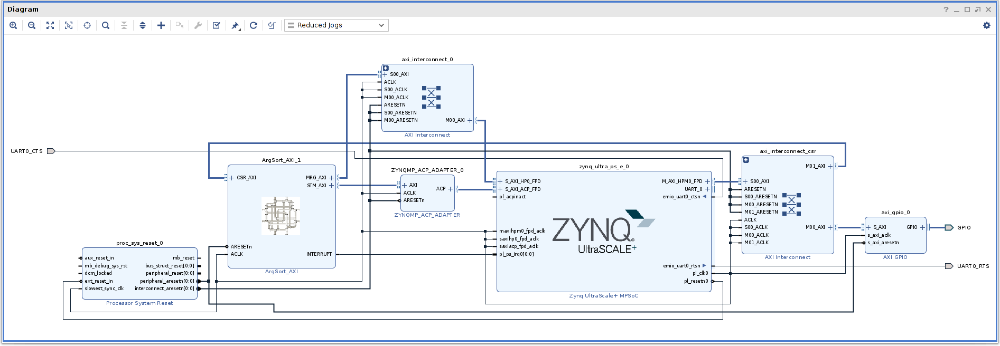

# VHDL で書くマージソーター(ArgSort-Ultra96)


## はじめに


別記事 [「はじめに」] を参照してください。

この記事では[「Argsort IP」] で紹介した ArgSort_AXI IP を Ultra96 に実装した結果を紹介します。

この記事で説明する ArgSort-Ultra96 はGitHub にて公開しています。
* https://github.com/ikwzm/ArgSort-Ultra96


## ArgSort-Ultra96 のデザイン


### デザインブロック


ArgSort-Ultra96 は次図のようなデザインになっています。




Fig.1 ArgSort-Ultra96 のデザインブロック

<br />


ArgSort_AXI のバージョンは 1.2 です。前回説明した[「ArgSort IP」]で説明した IP のバージョンは 1.3 ですが、ArgSort-Ultra96 を実装した時期は少し古いため 1.2 を使っています。


ArgSort_AXI の STM_AXI は [ZynqMP-ACP-Adapter] を通して PS 部の S_AXI_ACP_FPD に接続しています。[ZynqMP-ACP-Adapter] と ACP に関する詳細な説明は次の記事を参照してください。
  * [『ZynqMP ACP と AXI をつなぐアダプタ』 @Qiita]


ArgSort_AXI、 ZynqMP-ACP-Adapter、AXI Interconnect のクロックは PS 部の PL_CLK0 を直接接続しています。PL_CLK0 の周波数はソフトウェアによって 250MHz に設定されます。 


### ArgSort_AXI のパラメータの設定値


ArgSort_AXI の主なパラメーターは次のように設定しています。これらのパラメーターのうち、MRG_WAYS、MRG_WORDS、STM_FEEDBACK の値を振ってそれ毎にビルドしたリソース量と実行時間を計測しました。


Table.1 ArgSort_AXI の主なパラメータの設定値

<table border="2">
  <tr>
    <td align="center" colspan="2">Parameter</td>
    <td rowspan="2">Value</td>
  </tr>
  <tr>
    <td align="center">Categoly</td>
    <td align="center">Name</td>
  <tr>
    <td rowspan="7">CORE</td>
    <td>WORD_BITS</td>
    <td>32</td>
  </tr>
  <tr>
    <td>INDEX_BITS</td>
    <td>32</td>
  </tr>
  <tr>
    <td>COMP_SIGN</td>
    <td>FALSE</td>
  </tr>
  <tr>
    <td>SORT_ORDER</td>
    <td>0</td>
  </tr>
  <tr>
    <td>MRG_WAYS</td>
    <td>[16,32] (可変)</td>
  </tr>
  <tr>
    <td>MRG_WORDS</td>
    <td>[1,2](可変)</td>
  </tr>
  <tr>
    <td>STM_FEEDBACK</td>
    <td>[0,1,2] (可変)</td>
  </tr>
  <tr>
    <td rowspan="2">STM_AXI</td>
    <td>STM_AXI_ADDR_WIDTH</td>
    <td>32</td>
  </tr>
  <tr>
    <td>STM_AXI_DATA_WIDTH</td>
    <td>128</td>
  </tr>
  <tr>
    <td rowspan="2">MRG_AXI</td>
    <td>MRG_AXI_ADDR_WIDTH</td>
    <td>32</td>
  </tr>
  <tr>
    <td>MRG_AXI_DATA_WIDTH</td>
    <td>128</td>
  </tr>
</table>


## 結果


### 使用リソース


次表に MRG_WAYS、MRG_WORDS、STM_FEEDBACK を振ったそれぞれのデザインを Ultra96 に実装した時のリソースの使用状況を示します。なお、MRG_WASY が32 で MRG_WORDS が2 以上は Ultra96 で使われているデバイスには入りきりませんでした。

Table.2 Utilization

<table border="2">
  <tr>
    <td align="center" colspan="4">Design</td>
    <td align="center" colspan="4">Resources</td>
    <td align="center">Freq</td>
  </tr>
  <tr>
    <td align="center">Name</td>
    <td align="center">MRG<br />WAYS</td>
    <td align="center">MRG<br />WORDS</td>
    <td align="center">STM<br />FB</td>
    <td align="center">CLB<br />LUTs</td>
    <td align="center">CLB<br />Register</td>
    <td align="center">BLOCK<br />RAM</td>
    <td align="center">DSPs</td>
    <td align="center">Freq<br />[MHz]</td>
  </tr>
  <tr>
    <td>argsort_16_1_0</td>
    <td align="center">16</td>
    <td align="center">1</td>
    <td align="center">0</td>
    <td align="center">42142</td>
    <td align="center">27011</td>
    <td align="center">38</td>
    <td align="center">0</td>
    <td align="center">250</td>
  </tr>
  <tr>
    <td>argsort_16_1_1</td>
    <td align="center">16</td>
    <td align="center">1</td>
    <td align="center">1</td>
    <td align="center">41865</td>
    <td align="center">27249</td>
    <td align="center">38</td>
    <td align="center">0</td>
    <td align="center">250</td>
  </tr>
  <tr>
    <td>argsort_16_1_2</td>
    <td align="center">16</td>
    <td align="center">1</td>
    <td align="center">2</td>
    <td align="center">41799</td>
    <td align="center">26261</td>
    <td align="center">54</td>
    <td align="center">0</td>
    <td align="center">250</td>
  </tr>
  <tr>
    <td>argsort_16_2_0</td>
    <td align="center">16</td>
    <td align="center">2</td>
    <td align="center">0</td>
    <td align="center">59246</td>
    <td align="center">55456</td>
    <td align="center">38</td>
    <td align="center">0</td>
    <td align="center">250</td>
  </tr>
  <tr>
    <td>argsort_16_2_1</td>
    <td align="center">16</td>
    <td align="center">2</td>
    <td align="center">1</td>
    <td align="center">60828</td>
    <td align="center">57063</td>
    <td align="center">38</td>
    <td align="center">0</td>
    <td align="center">250</td>
  </tr>
  <tr>
    <td>argsort_16_2_2</td>
    <td align="center">16</td>
    <td align="center">2</td>
    <td align="center">2</td>
    <td align="center">58819</td>
    <td align="center">55210</td>
    <td align="center">70</td>
    <td align="center">0</td>
    <td align="center">250</td>
  </tr>
  <tr>
    <td>argsort_32_1_0</td>
    <td align="center">32</td>
    <td align="center">1</td>
    <td align="center">0</td>
    <td align="center">64126</td>
    <td align="center">45025</td>
    <td align="center">70</td>
    <td align="center">15</td>
    <td align="center">250</td>
  </tr>
  <tr>
    <td>argsort_32_1_1</td>
    <td align="center">32</td>
    <td align="center">1</td>
    <td align="center">1</td>
    <td align="center">66621</td>
    <td align="center">46356</td>
    <td align="center">70</td>
    <td align="center">15</td>
    <td align="center">250</td>
  </tr>
  <tr>
    <td>argsort_32_1_2</td>
    <td align="center">32</td>
    <td align="center">1</td>
    <td align="center">2</td>
    <td align="center">64988</td>
    <td align="center">44866</td>
    <td align="center">198</td>
    <td align="center">15</td>
    <td align="center">250</td>
  </tr>
  <tr>
    <td>argsort_32_2_0</td>
    <td align="center">32</td>
    <td align="center">2</td>
    <td align="center">0</td>
    <td align="center" colspan="4">resource over</td>
    <td align="center"></td>
  </tr>
  <tr>
    <td colspan="4">zcu3egsbva48-1 resouce available</td>
    <td align="center">70560</td>
    <td align="center">141120</td>
    <td align="center">216</td>
    <td align="center">360</td>
    <td align="center"></td>
  </tr>
</table>


Ultra96 で使われているデバイスが持っている LUT の数のうち、使用した LUT の数を次図に示します。


")

Fig.2 Utlization(LUTs %)

<br />


### 性能


次表にMRG_WAYS、MRG_WORDS、STM_FEEDBACK を振ったそれぞれのデザインを Ultra96 で実行した時にかかった時間とスループットを示します。

ソートするワード数は、5,000ワードから 1,000,000ワードまでを 5000 ワード毎にかかった時間を計測していますが、そのうち下の表には 10,000ワード、100,000ワード、1,000,000 ワードの時の時間を示しています。スループットは、5,000ワードから 1,000,000ワードまでを 5000 ワード毎に計測したスループット(ソートするワード数/かかった時間)の平均値を示しています。

参考までに最下行に ZynqMP の CPU(arm64) で numpy ライブラリの argsort() でソートした時間とスループットを示しています。


Table.3 Performance

<table border="2">
  <tr>
    <td align="center" colspan="4">Design</td>
    <td align="center" colspan="3">Sort time [msec]</td>
    <td align="center" rowspan="2">Throughput <br />Average<br />[Mwords/sec]</td>
  </tr>
  <tr>
    <td align="center">Name</td>
    <td align="center">MRG<br />WAYS</td>
    <td align="center">MRG<br />WORDS</td>
    <td align="center">STM<br />FB</td>
    <td align="center">10K<br />[words]</td>
    <td align="center">100K<br />[words]</td>
    <td align="center">1M<br />[words]</td>
  <tr>
    <td>argsort_16_1_0</td>
    <td align="center">16</td>
    <td align="center">1</td>
    <td align="center">0</td>
    <td align="right">0.569</td>
    <td align="right">4.766</td>
    <td align="right">54.456</td>
    <td align="right">18.75</td>
  </tr>
  <tr>
    <td>argsort_16_1_1</td>
    <td align="center">16</td>
    <td align="center">1</td>
    <td align="center">1</td>
    <td align="right">0.400</td>
    <td align="right">3.000</td>
    <td align="right">34.355</td>
    <td align="right">29.51</td>
  </tr>
  <tr>
    <td>argsort_16_1_2</td>
    <td align="center">16</td>
    <td align="center">1</td>
    <td align="center">2</td>
    <td align="right">0.384</td>
    <td align="right">2.674</td>
    <td align="right">27.644</td>
    <td align="right">36.04</td>
  </tr>
  <tr>
    <td>argsort_16_2_0</td>
    <td align="center">16</td>
    <td align="center">2</td>
    <td align="center">0</td>
    <td align="right">0.436</td>
    <td align="right">3.219</td>
    <td align="right">42.970</td>
    <td align="right">24.13</td>
  </tr>
  <tr>
    <td>argsort_16_2_1</td>
    <td align="center">16</td>
    <td align="center">2</td>
    <td align="center">1</td>
    <td align="right">0.325</td>
    <td align="right">2.047</td>
    <td align="right">31.311</td>
    <td align="right">33.89</td>
  </tr>
  <tr>
    <td>argsort_16_2_2</td>
    <td align="center">16</td>
    <td align="center">2</td>
    <td align="center">2</td>
    <td align="right">0.328</td>
    <td align="right">1.802</td>
    <td align="right">26.314</td>
    <td align="right">40.01</td>
  </tr>
  <tr>
    <td>argsort_32_1_0</td>
    <td align="center">32</td>
    <td align="center">1</td>
    <td align="center">0</td>
    <td align="right">0.422</td>
    <td align="right">3.384</td>
    <td align="right">39.381</td>
    <td align="right">25.69</td>
  </tr>
  <tr>
    <td>argsort_32_1_1</td>
    <td align="center">32</td>
    <td align="center">1</td>
    <td align="center">1</td>
    <td align="right">0.341</td>
    <td align="right">2.494</td>
    <td align="right">27.748</td>
    <td align="right">36.31</td>
  </tr>
  <tr>
    <td>argsort_32_1_2</td>
    <td align="center">32</td>
    <td align="center">1</td>
    <td align="center">2</td>
    <td align="right">0.595</td>
    <td align="right">2.711</td>
    <td align="right">27.433</td>
    <td align="right">36.79</td>
  </tr>
  <tr>
    <td colspan="4">ZynqMP(arm64) numpy.argsort()</td>
    <td align="right">1.790</td>
    <td align="right">32.036</td>
    <td align="right">1320.921</td>
    <td align="right">1.49</td>
  </tr>
</table>


次図にスループットの平均値をグラフで示します。


![Fig.3 Throughput Average [Mwords/sec]](argsort-ultra96-performance.jpg "Fig.3 Throughput Average [Mwords/sec]")

Fig.3 Throughput Average [Mwords/sec]

<br />


## テストの手順


### テスト環境

* ハードウェア: Avnet Ultra96-V2
* ソフトウェア: [ZynqMP-FPGA-Linux v2021.1.1] (Linux Kernel 5.10 + Debian 11)


### インストール


#### Ultra96/Ultra96-V2 の準備


Ultra96/Ultra96-V2 に ZynqMP-FPGA-Linux または ZynqMP-FPGA-Ubuntu20.04 をインストールします。インストール方法は次のURLを参照してください。
* https://github.com/ikwzm/ZynqMP-FPGA-Linux/blob/v2021.1.1/doc/install/ultra96v2.md
* https://github.com/ikwzm/ZynqMP-FPGA-Ubuntu20.04/blob/v2021.1-desktop-1/doc/install/ultra96v2-desktop.md
* [『UltraZed/Ultra96/Ultra96-V2/KV260 向け Debian GNU/Linux (v2021.1版) ブートイメージの提供』@Qiita]


#### ArgSort-Ultra96 のダウンロード


次のように Ultra96/Ultra96-V2 に ArgSort-Ultra96 をダウンロードします。


```console
fpga@debian-fpga:~/$ git clone --branch 1.2.1 git://github.com/ikwzm/ArgSort-Ultra96.git
fpga@debian-fpga:~/$ cd ArgSort-Ultra96
```


#### FPGA ビットストリームとデバイスツリーのインストール


次のようにテストの対象となるデザインのビットストリームファイルとデバイスツリーを Ultra96/Ultra96-V2 にインストールします。デバイスツリーのインストールには Device Tree Overlay を使用しています。インストールするための Rakefile を用意しているので、rake コマンドを実行してインストールします。環境変数 TARGET  にはデザイン名を指定します。


```console
fpga@debian-fpga:~/ArgSort-Ultra96$ sudo TARGET=argsort_16_2_2 rake install
gzip -d -f -c argsort_16_2_2.bin.gz > /lib/firmware/argsort_16_2_2.bin
./dtbocfg.rb --install argsort --dts argsort_16_2_2_5.4.dts
/tmp/dtovly20201118-1281-1tf8e0q: Warning (unit_address_vs_reg): /fragment@2/__overlay__/uio_argsort: node has a reg or ranges property, but no unit name
/tmp/dtovly20201118-1281-1tf8e0q: Warning (avoid_unnecessary_addr_size): /fragment@2: unnecessary #address-cells/#size-cells without "ranges" or child "reg" property
[10952.701089] fpga_manager fpga0: writing argsort_16_2_2.bin to Xilinx ZynqMP FPGA Manager
[10952.861395] OF: overlay: WARNING: memory leak will occur if overlay removed, property: /fpga-full/firmware-name
[10952.874409] fclkcfg amba_pl@0:fclk0: driver version : 1.7.1
[10952.879998] fclkcfg amba_pl@0:fclk0: device name    : amba_pl@0:fclk0
[10952.886447] fclkcfg amba_pl@0:fclk0: clock  name    : pl0_ref
[10952.892194] fclkcfg amba_pl@0:fclk0: clock  rate    : 249999998
[10952.898138] fclkcfg amba_pl@0:fclk0: clock  enabled : 1
[10952.903363] fclkcfg amba_pl@0:fclk0: remove rate    : 1000000
[10952.909107] fclkcfg amba_pl@0:fclk0: remove enable  : 0
[10952.914327] fclkcfg amba_pl@0:fclk0: driver installed.
[10952.935858] u-dma-buf udmabuf-argsort-in: driver version = 3.2.0
[10952.941868] u-dma-buf udmabuf-argsort-in: major number   = 241
[10952.947704] u-dma-buf udmabuf-argsort-in: minor number   = 0
[10952.953360] u-dma-buf udmabuf-argsort-in: phys address   = 0x0000000070400000
[10952.960498] u-dma-buf udmabuf-argsort-in: buffer size    = 33554432
[10952.966762] u-dma-buf amba_pl@0:udmabuf_argsort_in: driver installed.
[10952.988678] u-dma-buf udmabuf-argsort-out: driver version = 3.2.0
[10952.994773] u-dma-buf udmabuf-argsort-out: major number   = 241
[10953.000697] u-dma-buf udmabuf-argsort-out: minor number   = 1
[10953.006438] u-dma-buf udmabuf-argsort-out: phys address   = 0x0000000072400000
[10953.013662] u-dma-buf udmabuf-argsort-out: buffer size    = 33554432
[10953.020014] u-dma-buf amba_pl@0:udmabuf_argsort_out: driver installed.
[10953.085033] u-dma-buf udmabuf-argsort-tmp: driver version = 3.2.0
[10953.091130] u-dma-buf udmabuf-argsort-tmp: major number   = 241
[10953.097060] u-dma-buf udmabuf-argsort-tmp: minor number   = 2
[10953.102804] u-dma-buf udmabuf-argsort-tmp: phys address   = 0x0000000074400000
[10953.110028] u-dma-buf udmabuf-argsort-tmp: buffer size    = 134217728
[10953.116466] u-dma-buf amba_pl@0:udmabuf_argsort_tmp: driver installed.

```


### テストの実行


#### サンプルデータの生成


ソートするデータのサンプルを用意します。サンプルデータを生成する Python スクリプト generage_sample.py を用意しています。生成するデータの大きさを指定してサンプルデータを生成します。このスクリプトを直接実行するか、rake コマンドから実行します。


```console
fpga@debian-fpga:~/ArgSort-Ultra96$ rake sample_0001000000.npy
python3 generate_sample.py --size 1000000 --sample sample_0001000000.npy
generate_sample: sample_file : sample_0001000000.npy
generate_sample: size        : 1000000
generate_sample: time        : 44.262 [msec]

```


#### 期待値データの生成


サンプルデータを Python の numpy.argsort() を使ってソートしたデータを用意します。これは ArgSort-Ultra96 によってソートした結果データと比較して正常にソートされたかをチェックするのに使います。期待値データを生成する Python のスクリプト generate_expect.py を用意しています。このスクリプトを直接実行するか、rake コマンドから実行します。ついでに期待値データを生成する時間を計測してログに残しておきます。


```console
fpga@debian-fpga:~/ArgSort-Ultra96$ rake expect_0001000000.npy
python3 generate_expect.py --sample sample_0001000000.npy --expect expect_0001000000.npy --log expect.log
generate_expect: sample_file  : sample_0001000000.npy
generate_expect: expect_file  : expect_0001000000.npy
generate_expect: size         : 1000000
generate_expect: average_time : 1325.425 # [msec]
generate_expect: throughput   :    0.754 # [mwords/sec]

```


#### ArgSort-Ultra96 を実行


ArgSort-Ultra96 を実行してサンプルデータをソートします。ソートされた結果のデータを保存し、ソートにかかった時間を計測してログに残します。ArgSort-Ultra96 を実行する Python スクリプト argsort_test.py を用意しています。また、ArgSort-Ultra96 がソートした結果と numpy.argsort() がソートして期待値とを比較します。比較する Python スクリプト check_result.py を用意しています。これらのスクリプトを直接実行するか、rake コマンドから実行します。


```console
fpga@debian-fpga:~/ArgSort-Ultra96$ rake test_1000000
python3 argsort_test.py --sample sample_0001000000.npy --result result_0001000000.npy -n 10 -d 2 --log argsort_16_2_2.log
argsort_test   : Version      : 1.2
argsort_test   : Ways         : 16
argsort_test   : Words        : 2
argsort_test   : Feedback     : 2
argsort_test   : WordBits     : 32
argsort_test   : IndexBits    : 32
argsort_test   : Sort Order   : 0
argsort_test   : Sign Compare : 0
argsort_test   : Max Size     : 268435455
argsort_test   : Debug Enable : 1
argsort_test   : sample_file  : sample_0001000000.npy
argsort_test   : size         : 1000000
argsort_test   : debug_mode   : 2
argsort_test   : loops        : 10
argsort_test   : time         :   26.149 # [msec]
argsort_test   : time         :   26.515 # [msec]
argsort_test   : time         :   26.186 # [msec]
argsort_test   : time         :   26.037 # [msec]
argsort_test   : time         :   26.611 # [msec]
argsort_test   : time         :   26.458 # [msec]
argsort_test   : time         :   25.907 # [msec]
argsort_test   : time         :   26.645 # [msec]
argsort_test   : time         :   26.656 # [msec]
argsort_test   : time         :   25.674 # [msec]
argsort_test   : result_file  : result_0001000000.npy
argsort_test   : average_time :   26.284 # [msec]
argsort_test   : throughput   :   38.046 # [mwords/sec]
argsort_test   : Debug_Time(0):   25.199 # [msec]
argsort_test   : Debug_Time(1):   16.501 # [msec]
argsort_test   : Debug_Time(2):    4.860 # [msec]
argsort_test   : Debug_Time(3):    3.838 # [msec]
python3 check_result.py --sample sample_0001000000.npy --result result_0001000000.npy --expect expect_0001000000.npy
check_result: sample file : sample_0001000000.npy
check_result: expect file : expect_0001000000.npy
check_result: result file : result_0001000000.npy
check_result: OK

```


### アンインストール


#### デバイスツリーのアンインストール


テストが終わったらデバイスツリーをアンインストールします。別のデザインをインストールして実行するためには必ず現在のデザインをアンインストールしておく必要があります。アンインストールにもインストールと同様に Device Tree Overlay を使います。インストールと同様に rake コマンドを使ってアンインストールします。


```console
fpga@debian-fpga:~/ArgSort-Ultra96$ sudo rake uninstall
./dtbocfg.rb --remove argsort
[11218.745653] u-dma-buf amba_pl@0:udmabuf_argsort_tmp: driver removed.
[11218.757907] u-dma-buf amba_pl@0:udmabuf_argsort_out: driver removed.
[11218.770021] u-dma-buf amba_pl@0:udmabuf_argsort_in: driver removed.
[11218.777459] fclkcfg amba_pl@0:fclk0: driver removed.

```


## デザインのビルド


### ビルド環境

* 開発ツール: Xilinx Vivado 2020.1 or 2020.2
* IP: [ArgSort_AXI IP 1.2]、[ZynqMP-ACP-Adapter IP 0.4]


#### ArgSort-Ultra96 のダウンロード


次のようにビルド用コンピューターに ArgSort-Ultra96 をダウンロードします。


```console
shell$ git clone --branch 1.2.1 git://github.com/ikwzm/ArgSort-Ultra96.git
shell$ cd ArgSort-Ultra96
```


### ビルド用スクリプトファイル


各デザイン毎にスクリプトファイルを用意しています。 argsort_16_2\_2 を例にすると次のようになります。
* argsort_16_2\_2/
  * create_project.tcl
  * design_1.bif
  * design_1\_bd_2020.1.tcl
  * design_1\_bd_2020.2.tcl
  * design_1\_pin.xdc
  * implementation.tcl


### ビルド環境の設定


Xilinx Vivado 2020.1 または 2020.2 が動作する環境を設定します。


```console
shell$ source /opt/Xilinx/Vivado/2020.2/settings64.sh
```


### プロジェクトの生成


プロジェクトを生成するためには、スクリプトが格納されているディレクトリに移動して vivado で create_project.tcl を実行します。以下の例では vivado のコマンドラインから実行しています。


```console
shell$ cd argsort_16_2_2
shell$ vivado -mode batch -source create_project.tcl
```


### 論理合成と配置配線


プロジェクトの論理合成と配置配線をしてビットストリームファイルを生成するためには implementation.tcl を使用します。


```console
shell$ vivado -mode batch -source implementation.tcl
```


生成されたビットストリームファイルは project.runs/impl_1/design_1\_wrapper.bit です。なお、このスクリプトでビットストリームファイルを生成した場合は、使用リソースやタイミングチェックなどのレポートファイル project.rpt が生成されます。


### バイナリ—ファイルの生成


ビットストリームファイルから PL はダウンロードするためのバイナリ—ファイルを生成するためには、bootgen コマンドと design_1.bif を使います。


```console
shell$ bootgen -image design_1.bif -arch zynqmp -w -o ../argsort_16_2_2.bin
shell$ cd ..
shell$ gzip argsort_16_2_2.bin
```


## 所感


### バス帯域について


ArgSort で使用しているマージソーターコアは [マルチワード マージソート ノード] で説明したように１クロックあたりに出力できるワード数を複数ワードにすることができます。[ArgSort IP 1.2] ではこのパラメータの値は MRG_WORDS で指定します。

本来ならこのパラメータを１から２に変更することで性能が倍になるはずです。しかし次の表で示すようにそれほどの差は無いように思われます。

Table.4 MRG_WORDSの違いによる性能の比較

<table border="2">
  <tr>
    <td align="center" colspan="4">Design</td>
    <td align="center" rowspan="2">Throughput <br />Average<br />[Mwords/sec]</td>
    <td align="center" rowspan="2">MRG_WORDS<br />1-&gt; 2 Up [%]</td>
  </tr>
  <tr>
    <td align="center">Name</td>
    <td align="center">MRG<br />WAYS</td>
    <td align="center">MRG<br />WORDS</td>
    <td align="center">STM<br />FB</td>
  <tr>
    <td>argsort_16_1_0</td>
    <td align="center" rowspan="2">16</td>
    <td align="center">1</td>
    <td align="center" rowspan="2">0</td>
    <td align="right">18.75</td>
    <td align="right" rowspan="2">28.69 % Up</td>
  </tr>
  <tr>
    <td>argsort_16_2_0</td>
    <td align="center">2</td>
    <td align="right">24.13</td>
  <tr>
    <td>argsort_16_1_1</td>
    <td align="center" rowspan="2">16</td>
    <td align="center">1</td>
    <td align="center" rowspan="2">1</td>
    <td align="right">29.51</td>
    <td align="right" rowspan="2">14.84 % Up</td>
  </tr>
  <tr>
    <td>argsort_16_2_1</td>
    <td align="center">2</td>
    <td align="right">33.89</td>
  <tr>
    <td>argsort_16_1_2</td>
    <td align="center" rowspan="2">16</td>
    <td align="center">1</td>
    <td align="center" rowspan="2">2</td>
    <td align="right">36.04</td>
    <td align="right" rowspan="2">11.02 % Up</td>
  </tr>
  <tr>
    <td>argsort_16_2_2</td>
    <td align="center">2</td>
    <td align="right">40.01</td>
</table>


そこで ArgSort IP の MRG-AXI の波形を ILA(Integrated Logic Analyzer) で実測してみました。 


Fig.4 ArgSort IP の MRG-AXI の波形

<br />


この波形をみて分かる通り、データの読み出しと書き込みが同時に発生すると、読み出しと書き込み双方の転送速度が落ちているのがわかります。


これは考えてみれば当たり前の話で、もし argsort_16_2\_2 がフルに動作するためには MRG-AXI のデータ帯域は 128bit(16Byte=ソートデータの2ワード分)×250MHz(動作周波数)×２(読み出しと書き込みの同時アクセス) で8GByte/sec 必要になります。しかし、Ultra96-V2 のシステムメモリである DDR-SDRAM は32bit(4Byte)×2(DDR分)×533MHz で 4.264GByte/sec しかありません。つまり元々システムメモリの帯域が足りなかったのです。私の設計ミスでした。


## 参照

* 目次: [「はじめに」]
* 次回: [「ArgSort-Kv260」]
* 前回: [「ArgSort IP」]
* https://github.com/ikwzm/ArgSort-Ultra96
* https://github.com/ikwzm/Merge_Sorter
* https://github.com/ikwzm/ZynqMP-FPGA-Linux
* https://github.com/ikwzm/ZynqMP-FPGA-Ubuntu20.04
* [『ZynqMP ACP と AXI をつなぐアダプタ』 @Qiita]
* [『UltraZed/Ultra96/Ultra96-V2/KV260 向け Debian GNU/Linux (v2021.1版) ブートイメージの提供』@Qiita]


[「はじめに」]: https://github.com/ikwzm/Merge_Sorter/blob/1.3.1/doc/ja/01_introduction.md "「VHDL で書くマージソーター(はじめに)」"
[「ワードの定義」]: https://github.com/ikwzm/Merge_Sorter/blob/1.3.1/doc/ja/02_word_package.md "「VHDL で書くマージソーター(ワードの定義)」"
[「ワード比較器」]: https://github.com/ikwzm/Merge_Sorter/blob/1.3.1/doc/ja/03_word_compare.md "「VHDL で書くマージソーター(ワード比較器)」"
[「ソーティングネットワーク」]: https://github.com/ikwzm/Merge_Sorter/blob/1.3.1/doc/ja/04_sorting_network.md "「VHDL で書くマージソーター(ソーティングネットワーク)」"
[「バイトニックマージソート」]: https://github.com/ikwzm/Merge_Sorter/blob/1.3.1/doc/ja/05_bitonic_sorter.md "「VHDL で書くマージソーター(バイトニックマージソート)」"
[「バッチャー奇偶マージソート」]: https://github.com/ikwzm/Merge_Sorter/blob/1.3.1/doc/ja/06_oddeven_sorter.md "「VHDL で書くマージソーター(バッチャー奇偶マージソート)」"
[「シングルワード マージソート ノード」]: https://github.com/ikwzm/Merge_Sorter/blob/1.3.1/doc/ja/07_merge_sort_node_single.md "「VHDL で書くマージソーター(シングルワード マージソート ノード)」"
[「マルチワード マージソート ノード」]: https://github.com/ikwzm/Merge_Sorter/blob/1.3.1/doc/ja/08_merge_sort_node_multi.md "「VHDL で書くマージソーター(マルチワード マージソート ノード)」"
[「マージソート ツリー」]: https://github.com/ikwzm/Merge_Sorter/blob/1.3.1/doc/ja/09_merge_sort_tree.md "「VHDL で書くマージソーター(マージソート ツリー)」"
[「端数ワード処理」]: https://github.com/ikwzm/Merge_Sorter/blob/1.3.1/doc/ja/10_merge_sort_core_1.md "「VHDL で書くマージソーター(端数ワード処理)」"
[「ストリーム入力」]: https://github.com/ikwzm/Merge_Sorter/blob/1.3.1/doc/ja/11_merge_sort_core_2.md "「VHDL で書くマージソーター(ストリーム入力)」"
[「ストリームフィードバック」]: https://github.com/ikwzm/Merge_Sorter/blob/1.3.1/doc/ja/12_merge_sort_core_3.md "「VHDL で書くマージソーター(ストリームフィードバック)」"
[「ArgSort IP」]: https://github.com/ikwzm/Merge_Sorter/blob/1.3.1/doc/ja/13_argsort.md "「VHDL で書くマージソーター(ArgSort IP)」"
[「ArgSort-Kv260」]: https://github.com/ikwzm/ArgSort-Kv260/blob/1.2.1/doc/ja/argsort-Kv260.md "「VHDL で書くマージソーター(ArgSort-Kv260)」"
[『ZynqMP ACP と AXI をつなぐアダプタ』 @Qiita]: https://qiita.com/ikwzm/items/302c28c18af8ca51388a "『ZynqMP ACP と AXI をつなぐアダプタ』 @Qiita"
[『UltraZed/Ultra96/Ultra96-V2/KV260 向け Debian GNU/Linux (v2021.1版) ブートイメージの提供』@Qiita]: https://qiita.com/ikwzm/items/a9adc5a7329b2eb36895 "『UltraZed/Ultra96/Ultra96-V2/KV260 向け Debian GNU/Linux (v2021.1版) ブートイメージの提供』@Qiita"
[ArgSort_AXI IP 1.2]: https://github.com/ikwzm/ArgSort-Ultra96/tree/1.2.0/ip/argsort_axi_1.2 "ArgSort_AXI IP 1.2"
[ZynqMP-ACP-Adapter]: https://github.com/ikwzm/ZynqMP-ACP-Adapter "ZynqMP-ACP-Adapter"
[ZynqMP-FPGA-Linux v2021.1.1]: https://github.com/ikwzm/ZynqMP-FPGA-Linux/tree/v2021.1.1 "ZynqMP-FPGA-Linux v2021.1.1"
